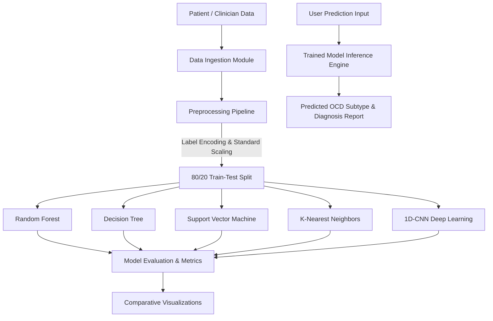

# 🧠 A Machine Learning-Based Predictive Analytics Framework for Early Diagnosis of Obsessive-Compulsive Disorder (OCD)

[](https://www.python.org/)
[](https://flask.palletsprojects.com/)
[](https://scikit-learn.org/)
[](https://www.tensorflow.org/)
[]()

---

## 📖 Executive Summary

**Obsessive-Compulsive Disorder (OCD)** is a neuro-psychiatric condition characterized by distressing intrusive thoughts (obsessions) and repetitive behaviors or mental rituals (compulsions). Early and accurate diagnosis is critical for clinical interventions, yet OCD is frequently underdiagnosed or delayed due to symptom heterogeneity and comorbid conditions.

This project implements an end-to-end **Predictive Analytics Web Framework** that assists clinicians, researchers, and users in the early screening, risk assessment, and subtype diagnosis of OCD. By synthesizing demographic indicators, symptom histories, comorbid diagnoses, and standardized **Yale-Brown Obsessive Compulsive Scale (Y-BOCS)** scores, the system deploys multiple supervised machine learning models and a 1D Convolutional Neural Network (CNN) to predict and classify OCD obsession subtypes.

---

## 🌟 Key Features

### 1. Dual User Portals
- **User / Patient Portal**:
  - Secure Registration & Login authentication.
  - Interactive self-assessment and clinical prediction form.
  - Real-time subtype risk diagnosis with instant feedback.
- **Admin Dashboard**:
  - Secure Admin authentication (`admin` / `admin`).
  - Safe in-memory CSV dataset upload and inspection.
  - One-click preprocessing pipeline (encoding, scaling, split).
  - Model training runner and hyperparameter-tuned model persistence.
  - Interactive comparative model visualization (Bar, Line, and Distribution charts).

### 2. Machine Learning & Deep Learning Suite
- **Random Forest Classifier**: Ensemble decision tree model for high generalizability and feature importance.
- **Decision Tree Classifier**: Interpretable baseline tree for clinical decision paths.
- **Support Vector Machine (SVM)**: RBF-kernel classifier for non-linear high-dimensional decision boundaries.
- **K-Nearest Neighbors (KNN)**: Distance-based classification analyzing nearest clinical patient profiles.
- **1D Convolutional Neural Network (CNN)**: Deep learning model leveraging 1D convolutions and feature extraction across clinical sequence representations.

### 3. Model Evaluation & Analytics
- Multi-metric evaluation comparing:
  - **Accuracy**
  - **Precision (Macro)**
  - **Recall (Macro)**
  - **F1-Score (Macro)**
  - **Support**
- Automatic generation of visual comparison charts exported to `static/plots/`.

---

## 📊 Dataset & Clinical Parameters

The application utilizes an OCD patient dataset (`ocd_patient_dataset.csv`) comprising over 5,700 patient clinical records with the following core attributes:

| Parameter | Type | Clinical Significance |
| :--- | :--- | :--- |
| **Patient ID** | Numerical | Unique record identifier (excluded during training) |
| **Demographics** | Categorical | `Age`, `Gender`, `Ethnicity`, `Marital Status`, `Education Level` |
| **Symptom Duration** | Numerical | Duration of symptoms experienced in months |
| **Clinical History** | Categorical | `Previous Diagnoses` (e.g., MDD, PTSD, Panic Disorder, None) |
| **Family History** | Binary | Family history of diagnosed OCD (`Yes` / `No`) |
| **Y-BOCS Obsessions Score** | Numerical (0–40) | Yale-Brown Obsessive Compulsive Scale score evaluating obsessions |
| **Y-BOCS Compulsions Score**| Numerical (0–40) | Yale-Brown Obsessive Compulsive Scale score evaluating compulsions |
| **Comorbidities** | Binary | `Depression Diagnosis` (`Yes`/`No`), `Anxiety Diagnosis` (`Yes`/`No`) |
| **Medications** | Categorical | Current medication regimens (e.g., SSRI, SNRI, Benzodiazepines) |
| **Target: Obsession Type** | Multi-class | Subtype classification: *Contamination*, *Harm-related*, *Symmetry*, *Hoarding*, *Religious* |
| **Compulsion Type** | Categorical | Manifested behavior: *Checking*, *Washing*, *Ordering*, *Counting*, etc. |

---

## 🏗️ System Architecture & Workflow



---

## 📁 Repository Structure

```plaintext
College-Project/
├── Dataset/
│   └── ocd_patient_dataset.csv     # Master clinical patient dataset
├── models/
│   ├── cnn.h5                      # Saved 1D-CNN trained model
│   ├── dt.pkl                      # Serialized Decision Tree model
│   ├── knn.pkl                     # Serialized KNN model
│   ├── rf.pkl                      # Serialized Random Forest model
│   └── svm.pkl                     # Serialized Support Vector Machine
├── static/
│   ├── images/                     # UI graphical assets
│   ├── plots/                      # Generated comparative evaluation charts
│   └── style.css                   # Custom stylesheets
├── templates/                      # Jinja2 HTML UI templates
│   ├── admin_dashboard.html        # Admin management console
│   ├── admin_login.html            # Admin login interface
│   ├── analysis.html               # Algorithm visual analytics
│   ├── comparison.html             # Multi-model comparison report
│   ├── home.html                   # Landing page
│   ├── login.html / register.html  # User authentication
│   ├── predict.html                # Patient clinical diagnosis form
│   ├── result.html                 # Prediction outcome display
│   ├── trainmodels.html            # Model training trigger interface
│   └── upload.html                 # Dataset upload interface
├── app.py                          # Flask backend application and routing
├── requirements.txt                # Python package dependencies
├── .gitignore                      # Git exclusion rules
└── README.md                       # Comprehensive project documentation
```

---

## ⚙️ Installation & Local Setup

### 1. Clone the Repository
```bash
git clone https://github.com/Ganeshk-39/College-Project.git
cd College-Project
```

### 2. Configure Virtual Environment (Recommended)
```bash
# Windows
python -m venv venv
venv\Scripts\activate

# Linux / macOS
python3 -m venv venv
source venv/bin/activate
```

### 3. Install Required Dependencies
```bash
pip install -r requirements.txt
```

### 4. Start the Application
```bash
python app.py
```

### 5. Access the Web Application
Open your browser and navigate to:
```
http://127.0.0.1:5000/
```

- **Default Admin Credentials**:
  - **Username**: `admin`
  - **Password**: `admin`

---

## 📈 Future Enhancements

- Integration of SHAP / LIME explainable AI (XAI) to interpret clinical feature contributions for individual patient predictions.
- Integration of EHR (Electronic Health Record) FHIR API standards for automated clinical intake.
- Cloud deployment with Docker and automated CI/CD workflows.

---

## 📜 License & Acknowledgments

- Developed for academic research and college project submission.
- Built with Python, Flask, Scikit-Learn, and TensorFlow.
